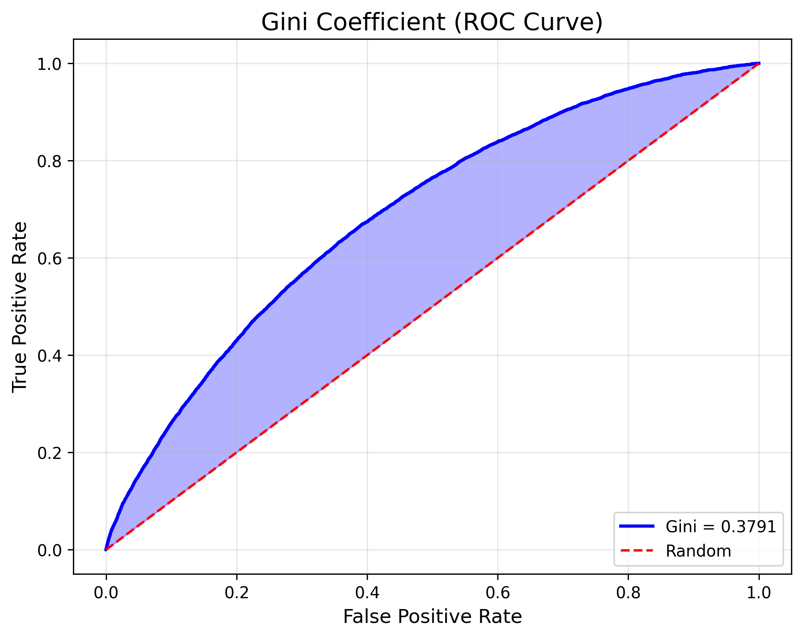
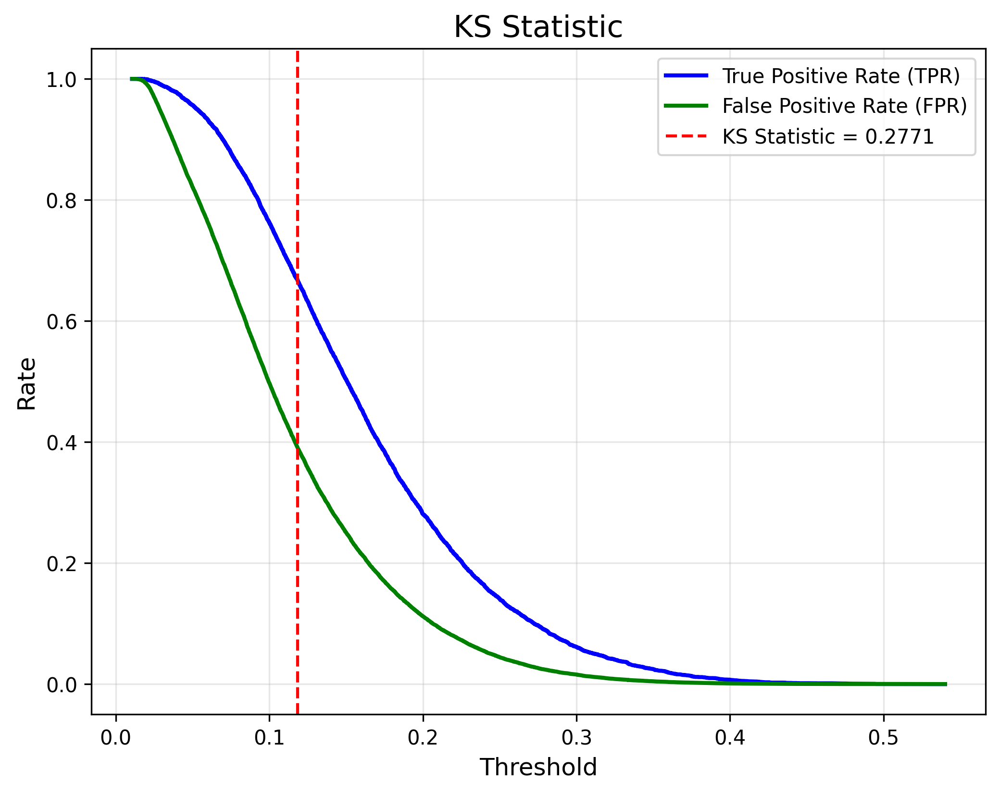

# 💳 End-to-End Credit Risk Scorecard Development
 
**Predicting Probability of Default (PD) and Constructing an Operational Scorecard using LendingClub Data**
 
> 💡 From Curiosity to Construction
"How do banks actually measure risk?"
This project began with a small spark of curiosity during a Credit Scoring course in my first semester. While we used SAS to modify existing codes provided by the professor, I felt a strong desire to understand the entire flow from scratch rather than just following a template.
> 
> Driven by this interest, I reached out to a Data scientist at ING Hub for advice and was recommended a specialized curriculum on credit risk modeling. This project is the result of my self-directed journey to reconstruct a full PD model using Python, ensuring I own every line of code and every strategic decision.
---

## 📊 Executive Summary
 
| Component | Specification |
|-----------|--------------|
| **Model** | Logistic Regression with custom p-value significance testing |
| **Performance** | AUC-ROC: 0.690, Gini: 0.379, KS Statistic: 0.277 |
| **Methodology** | Weight of Evidence (WoE) Binning, Information Value (IV) Analysis, PDO-based Scaling |
| **Business Output** | Optimal cut-off strategy balancing approval rate vs. bad rate |
| **Dataset** | LendingClub Loan Data (2007-2014, ~466K records) |
 
**What I'm Most Proud Of:**
## 🏆 Key Technical Achievements
* **Why I added p-values**: When I used scikit-learn, I realized it only gives predictions but doesn't tell me if a variable is actually reliable. In banking, you can't just say "the model said so." You need to prove it. So, I used a custom class to calculate p-values. By checking the statistical significance (using the Cramer-Rao bound), I could filter out variables that were just "lucky guesses" and keep only the ones that truly affect credit risk.

* **More than just Data Cleaning**: I spent a lot of time on WoE (Weight of Evidence) analysis. It wasn't just about making the data "clean"—it was about making sure the data made sense financially. For example, I checked every graph to see if a higher "Loan Grade" or "Interest Rate" consistently led to a higher risk score. This monotonicity check was where I really learned why domain knowledge is so important in this field.

* **End-to-End Pipeline Ownership**: I didn't want to just follow a manual. I wanted to see the entire flow from messy raw data to a final decision. I built a pipeline that covers everything: Cleaning, Binning, Modeling, and Scaling (300-850 scores). This gave me a clear understanding of how a data scientist’s work actually turns into a bank's lending strategy.
---

## 🔍 1. Data Engineering: WoE and IV (`preprocessing.ipynb`)

With over 100 raw features, my first goal was to find out which ones actually matter. I used **IV (Information Value)** and **WoE (Weight of Evidence)** to guide my decisions.

* **Filtering with IV**:
    * I used IV to rank the features by their predictive power. I found it interesting that some variables I expected to be strong, like emp_length (employment duration), actually had very little impact (IV < 0.02). On the other hand, grade and int_rate were the strongest predictors. This taught me to trust the data more than my initial assumptions.
* **The Goal of WoE**:
    * After separating Discrete and Continuous variables, I converted them into WoE. This wasn't just a math step; it was about turning messy categories into a clear, linear relationship with risk.
* **Fine to Coarse Classing**:
    * For continuous data, I started with 50 small bins **(Fine Classing)** to see the raw trend. Then, I merged them into 5-6 larger groups **(Coarse Classing)** to make the model more stable.
* **Applying Domain Knowledge**:
    * This is where I had to think about the "why." I checked every group to make sure the risk trend was **Monotonic** (meaning the risk moves in one consistent direction as the value changes). When I wasn't sure how to group certain values, I followed professional binning standards from my curriculum to ensure the model stayed financially logical.
---

## 📉 2. Statistical Modeling & Validation (`PD_Modeling.ipynb`)

I learned that in banking, being "accurate" isn't enough; the model must be statistically sound. This stage was about filtering out the noise and keeping only the features that truly matter.

* **Custom Logistic Regression**:
    * I found that scikit-learn doesn't show **p-values** for each feature. Since financial models need to be auditable, I used a custom class to calculate these values. This allowed me to see which variables were statistically significant and which were just there by chance.
* **Backwards Elimination**:
    * Instead of putting all 100+ features into the final model, I iteratively removed variables with p-values > 0.05. For example, features like purpose:educational or certain addr_state (location) groups were dropped because they didn't have enough statistical evidence to support their impact. This resulted in a more **compact and stable model**.
* **Measuring Success**:
    * **AUC-ROC & Gini**: This confirmed that the model has a decent ability to separate good and bad borrowers.
    
    * **KS Statistic**: I used this to find the point where the gap between the cumulative distribution of good and bad customers is maximized, which is a standard way to validate a PD model's power.
    

---

## 🎯 3. Scorecard Scaling & Business Strategy

In the final stage, I converted the model's probabilities into an intuitive **Credit Score (300-850)**. This makes the risk level easy to communicate to both the bank and the customers.

* **Scaling with PDO 20**:
I used the "Points to Double Odds" (PDO) method. By setting PDO to 20 and a base score of **600 (at 19:1 odds)**, I ensured that a 20-point increase in score means the borrower is twice as safe. This is a standard industry practice that makes the score distribution feel familiar, like a FICO score.
    

    * **Trade-off Analysis**: Based on the trade-off curve, I analyzed how changing the Cut-off score impacts both the business volume (Approval Rate) and risk level (Bad Rate).
    

---

## 🛠️ Tech Stack
* **Language**: Python
* **Data Analysis**: Pandas, NumPy
* **Modeling/Stats**: Scikit-learn, SciPy
* **Visualization**: Matplotlib, Seaborn

## 💡 Key Learnings & Future Steps
* **Ownership of the Full Pipeline**: 
This project was a journey to move beyond pre-made SAS templates. By reconstructing the entire PD model in Python, I now fully **"own" the process**—from messy data cleaning to the final credit decision. This hands-on experience gave me the confidence to build and troubleshoot a financial model from scratch.

* **The Necessity of Domain Knowledge**: 
I realized that data doesn't speak for itself in credit risk. Applying **WoE** and **Monotonicity checks** taught me that a modeler must have deep financial intuition to ensure the model makes sense in a real-world banking context. It's not just about the numbers; it's about the financial logic behind them.

* **What's Next (LGD & EAD)**: 
This project focused on **PD (Probability of Default)**, but it’s just the beginning. To complete the **"Expected Loss (EL = PD × LGD × EAD)"** framework, I am eager to expand my research into **LGD (Loss Given Default)** and **EAD (Exposure at Default)** modeling in my next steps.

The end.
